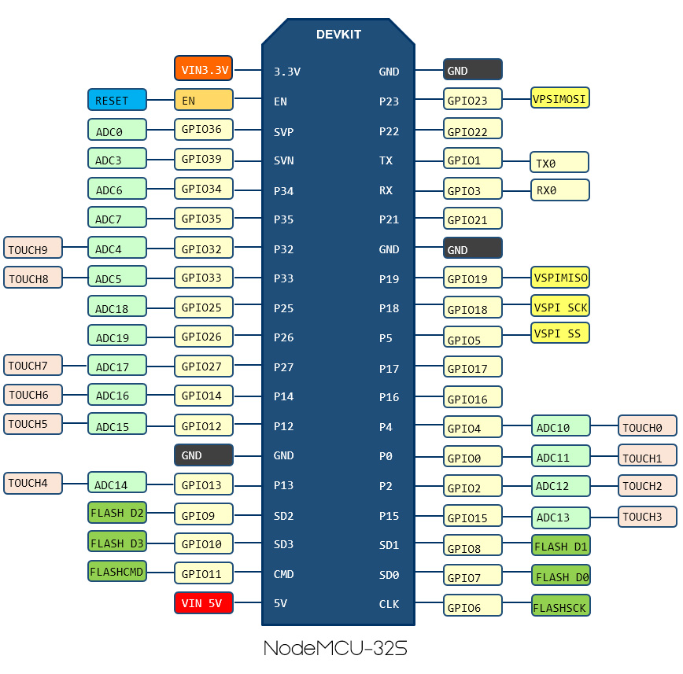

# esp32-plant-monitor
wip

Setup: 

Arduino IDE Setup: https://www.youtube.com/watch?v=wNtGHCrO7E4

Arduino Board manager: https://raw.githubusercontent.com/espressif/arduino-esp32/gh-pages/package_esp32_index.json
board pin reference: https://randomnerdtutorials.com/esp32-pinout-reference-gpios/

Board: NODE32S
left pin: source
middle pin: gate
right pin: drain

Required Parts:  
NodeMCU ESP32

Optional parts: 
CO2 - 
Temperature&Humidity - DHT11 
e-paper 1.54 inch

###### Reset board:

sudo python /home/johnz/.local/lib/python3.8/site-packages/esptool.py write_flash_status --non-volatile 0

sudo python /home/johnz/.local/lib/python3.8/site-packages/esptool.py --chip auto --port /dev/ttyUSB0 --baud 115200 --before default_reset --no-stub --after hard_reset write_flash -u --flash_mode dio --flash_freq 40m --flash_size 4MB 0x0 factory/factory_WROOM-32.bin

##### Transistors

###### NPN

VCC = + 
Ground = - 

Collector: Connect to LED +
Base: Connect to arduino pin (to switch on or off)
Emitter: Connect to Ground -

how to use transistors:
https://microcontrollerslab.com/how-to-use-transistor-as-a-switch/

C:\Users\anon3\AppData\Local\Arduino15\packages\esp32\hardware\esp32\2.0.2\tools

python C:\Users\anon3\AppData\Local\Arduino15\packages\esp32\hardware\esp32\2.0.2\tools\esptool.py write_flash_status --non-volatile 0
esptool.py v3.2

PINS:

Input only pins
GPIOs 34 to 39 are GPIs – input only pins. These pins don’t have internal pull-up or pull-down resistors. They can’t be used as outputs, so use these pins only as inputs:

GPIO 34
GPIO 35
GPIO 36
GPIO 39